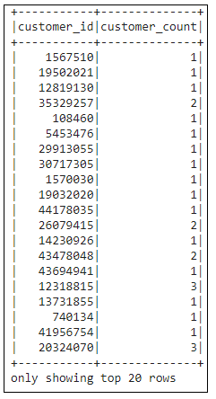
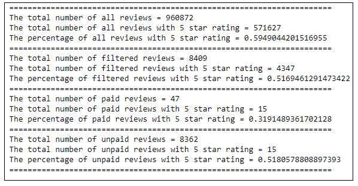

# Amazon Vine Analysis

## Overview

You are the first data expert at **BigMarket**, a startup that helps businesses optiomize their markting efforts. and you have been hired just in time too. One of BigMarket's clients has requested some pretty hefty analytics. The client **$ellby** is about to release a large catelog of products on a leading retail website. they want to kow how the review of their products comapred to the reviews of competitor products sold by their competitors. They are also interested in enrolling in a program that gives out free products to select reviewers but they want to know if it worth the cost. There are thousands of reviews and they are in words not numbersso you"ll have to translate them in order to analyze them. $ellby hired BigMarket because they believe in the power of big data. Now it's up to you to harness that power for your client.

For this project you'll be partnering with Jennifer, an account manager at BigMarket. SellBy, your client, loves to talk about the power of big data, but Jennifer isn't a data expert. So you start off the project by giving her a quick overview of what big data actually is.

## Purpose of this Analysis
Since your work with Jennifer on the SellBy project was so successful, you’ve been tasked with another, larger project: analyzing Amazon reviews written by members of the paid Amazon Vine program. The Amazon Vine program is a service that allows manufacturers and publishers to receive reviews for their products. Companies like SellBy pay a small fee to Amazon and provide products to Amazon Vine members, who are then required to publish a review.

In this project, you’ll have access to approximately 50 datasets. Each one contains reviews of a specific product, from clothing apparel to wireless products. You’ll need to pick one of these datasets and use PySpark to perform the ETL process to extract the dataset, transform the data, connect to an AWS RDS instance, and load the transformed data into pgAdmin. Next, you’ll use PySpark, Pandas, or SQL to determine if there is any bias toward favorable reviews from Vine members in your dataset. Then, you’ll write a summary of the analysis for Jennifer to submit to the SellBy stakeholders.

## Resources

Data: https://s3.amazonaws.com/amazon-reviews-pds/tsv/amazon_reviews_us_Watches_v1_00.tsv.gz

## Results

1) DataFrame - dataset - Watches - Dataframe

    2) DataFrame - customers_df

    

3) DataFrame - products_df

4) DataFrame - review_id

5) DataFrame - vine_df

6) SQL query - customers

7) SQL query - customers

8) SQL query - customers

9) SQL query - customers

## Review Summary

Results: Using bulleted lists and images of DataFrames as support, address the following questions:

How many Vine reviews and non-Vine reviews were there?
How many Vine reviews were 5 stars? How many non-Vine reviews were 5 stars?
What percentage of Vine reviews were 5 stars? What percentage of non-Vine reviews were 5 stars?

Summary: In your summary, state if there is any positivity bias for reviews in the Vine program. Use the results of your analysis to support your statement. Then, provide one additional analysis that you could do with the dataset to support your statement.