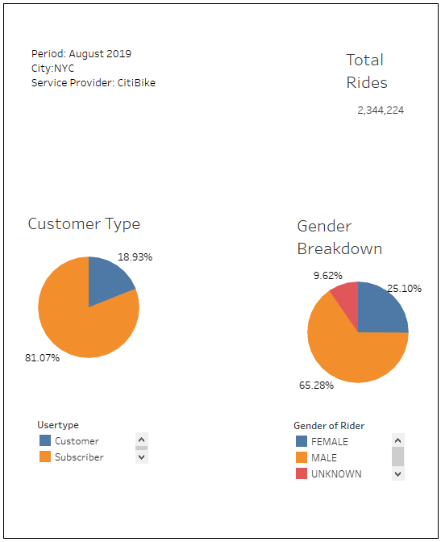
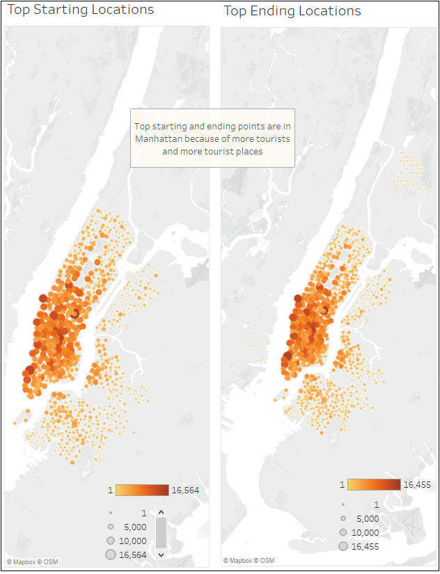
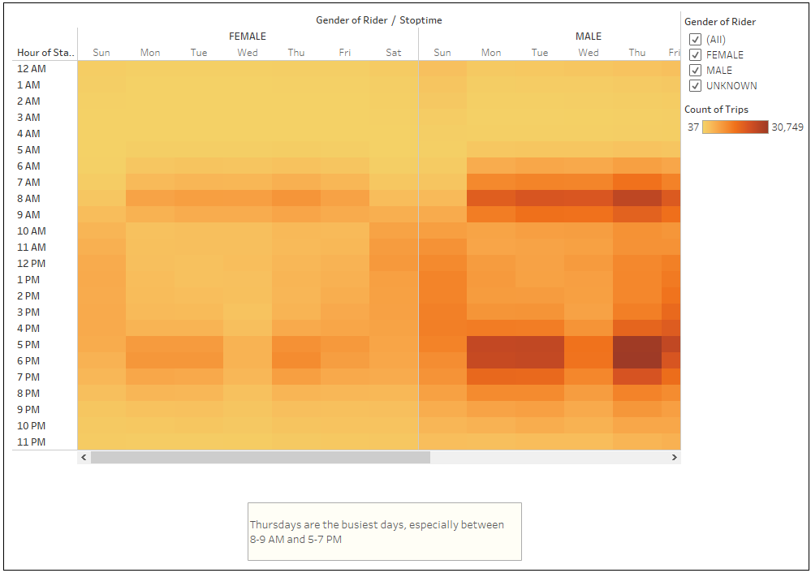
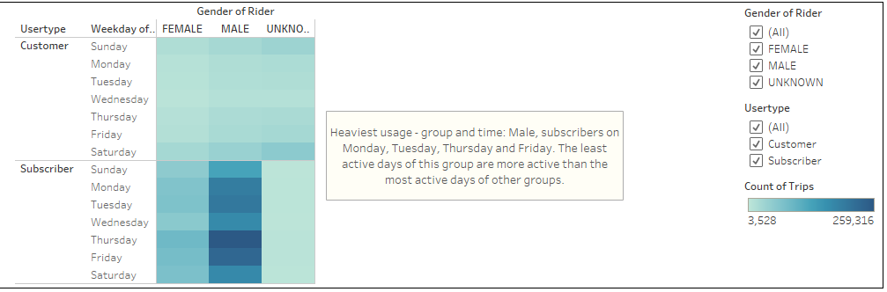

# Bike-Sharing

## Overview
Last summer, my friend Kate and I took the trip of a lifetime. New York City for two full weeks exploring historic landmarks like Central Park, the Statue of Liberty, and the Empire State Building. It was a magical experience and as we flew home together we looked through our vacation photos and had a realization. One of the key ingredients to the magic was an unlikely suspect, ***CitiBike***. Kate and I had biked everywhere which allowed us to really get to know the city and interact with the people who lived there and who were using bikes for their commutes. Back home, we thought what if we could start a similar bike share business for our hometown of Des Moines, Iowa. Kate and I start brainstorming and a few weeks later she called me with some incredible news. She has a potential angel investor who might be interested in providing seed funding to explore a bike-share program in Des Moines. This is an exciting prospect but you know you have to think realistically. The mechanics of making this business work might be quite different in Des Moines than in NYC. You decide that the first step is to figure out how the bike-share business actually works in NYC. From there you will create a proposal on how it might work in Des Moines. Kate is gregarious, friendly, and fearless. She should definitely be the face of the proposal. However, I have the data analytics experience and will take the lead on figuring out how this project might actually work.

## Purpose
In the past, Kate and I used Tableau to create some basic visualization worksheets, dashboards, and a short story.

Now that we've gotten a good idea of how to create our story, there is still some more work to be done to convince investors that a bike-sharing program in Des Moines is a solid business proposal. We decided that we will create some more visualizations and then add these new visualizations to the two we created in the past for our final presentation and analysis to pitch to investors.

## Resources
* Software: Visual Studio Code 1.49.1, Tableau Desktop (Public Version - 2020.3.0), Anaconda
* Language(s): Python for ETL
* Other Tool(s): Tableau for Visualization
* Data Source(s): 
    * Raw Data - https://s3.amazonaws.com/tripdata/201908-citibike-tripdata.csv.zip

## Results

### [***Link to Business Proposal on Tableau Public***](https://public.tableau.com/profile/govind6013#!/vizhome/Des_Moines_Bikesharing_Business_Proposal/Business_Proposal "Link to Business Proposal on Tableau")

### The Below Worksheets are parts of the Tableau Story

1. #### Worksheet 1 - Some basic information gathered from the data 

    **Image 1 (below)**

    

    **Observation/Description:**
    * The total number of rides in NYC in the month of August 2019 was 2,344,224. While this data relates to NYC, it can use used to get a rough estimate of the ridership in a city.
    * 81.07% of all rides were taken by Subscribers, while 18.93% was taken by Customers. A higher percentage of subscription adds to the stability of a business.
    * Males took 65.28% of the rides, Females 25.1% and Unknowns 9.62%

2. #### Worksheet 2 - Top Starting and Ending locations
    **Image 2 (below)**

    

    **Observation/Description:**
    * Downtown Manhattan was the top starting and ending location
    * This can be attributed to the fact that it has highest density of offices (thus commuters) as well as tourist spots (thus tourists)
    * This shows that having the bike stations at strategic locations is important - it might be costly to get stations there,  but it will drive ridership.

3. #### Worksheet 3 - Busiest times in a day

    **Image 3 (below)**
    

    **Observation/Description:**
    * In the morning, the number of rides start picking up between 7-8 AM, peaking between 8-9 AM, and then slowing between 10-11 AM.
    * In the evening, the number of rides start picking between 4-5 AM, peaking between 5-6 PM and slowing between 8-9 AM. 
    * The above both trends can be attributed to office commuters.
    * This also tells us that morning before 6 AM can be used for reparing bikes, similary 10-11:59 PM is a good time for servicing as well.

4. #### Worksheet 4 - Tripduration

    **Image 4 (below)**
    

    **Observation/Description:**
    * The number of trips increases as we move from 1 hour triplength to 5 hour triplength. 5-6 hours is the peak
    * As the triplenght increases the number of trips start decreasing, although the decrease is slower as compared to the rise in the point above.

5. #### Worksheet 5 - Tripduration by Gender

    **Image 5 (below)**
    

    **Observation/Description:**
    * for Males, the number of trips increases as we move from 1 hour triplength to 5 hour triplength. 5-6 hours is the peak.
    * for Males, as the triplenght increases the number of trips start decreasing, although the decrease is slower as compared to the rise in the point above.
    * For Females and people reporting Unknown gender, the trend is similar

6. #### Worksheet 6 - Trips by Weekday per hour
    **Image 6 (below)**
    
    **Observation/Description:**
    * This matches our analysis of peak hours in a day (point 3)
    * In the morning, the peak hours are betwen 7-10 AM, and post noon, the peak hours are 5-8 PM, presumably becaused of office commuters.
    * Weekdays were usually busier than weekends, again pointing to office commuters.
    * Thursday are the busiest days
    * Wednesdays are unusually less-busy days
    * Bike service should be scheduled in the mornings, or on Wednesday afternoons, as Thursdays are very good for business.

7. #### Worksheet 7 - Trips by Gender (Weekday per Hour)
    **Image 7 (below)**
    

    **Observation/Description:**
    * The results are a mirror of what we found in the step above
    * As Males constitute 65.28% of the riders, the male data is more pronounced as compared to data of other genders.

8. #### Worksheet 8 - Trips by Gender and User-type

    **Image 8 (below)**
    

    **Observation/Description:**
    * With 81% of users as Subscribers, 65.28% as Males, and Weekdays busier than Weekends, and Thursday as the busiest day, it comes as no surprise as the field with the most trips was corresponding to Male Subscribers on Thursday, follwed by Male subscribers on Friday, Tuesday, Monday, Saturday, Wednesday and Sunday.
    * The least busy day of the Male Subscribers is busier than the busiest days of the other groups.

## Summary

The NYC CitiBikes was a very good case study to start a profitable Ride sharing business. Below is a high-level summary of the analysis. 
1) The subscriber percentage is very high at 81.07% - a business with a high subscriber base and percentage can focus its energy on retaining its subscriber base rather than constantly hunting for new business. Various studies have shown that retaining a customer is way easier/cheaper than getting a new customer.
2) People identifying their gender as 'Male' constitute 65.28% of the riders. The gender ratio in NYC is 53% females and 47% males. This point to the fact that for some reasons the CitiBikes has not been able to attract Females as much as Males. This is an area of concern as well as opportunity.
3) Top Starting and Ending locations are in Manhattan. This shows that CitiBikes has done a good job in making rides within the reach of commuters and tourists. This in part explains the high subscriber percentage
4) 8AM-10AM and 4PM-8PM are busiest times of the days. CitiBikes seems to be doing a good job here in making bikes available to office commuters. This is an opporutnity/risk area.
5) The most popular tripduration is 5 hours to 6 hours, this trend is almost the same across genders.
6) Adding to point 4 above, Wednesday afternoons are an exception (less trips as compared to other weekdays). On Saturday and Sunday, the entire day seems a good time for rides except for early mornings and late nights. This trend is roughly the same across genders.
7) With 81% of users as Subscribers, 65.28% as Males, and Weekdays busier than Weekends, and Thursday as the busiest day, it comes as no surprise as the field with the most trips was corresponding to Male Subscribers on Thursday, follwed by Male subscribers on Friday, Tuesday, Monday, Saturday, Wednesday and Sunday. Ridership of Male Subscribers is so high that the least busy day of the Male Subscribers is busier than the busiest days of the other groups.

### Three (3) additional suggestions for future analysis
1. Tripduration by weekdays, this analysis can help in servicing the bikes better.
2. Top Starting and Ending Locations by weekdays (and hours) - this analysis can help in optimizing the availability of bikes at different locations. 
3. We already have a visualization for Trips by Gender and User-type (Worksheet 8 above). This is however restricted to days (Sun-Sat). We can dig deeper to find the hourly breakdown by Gender and User-type.

## Business Proposal for Stakeholders (as a clickable image)

